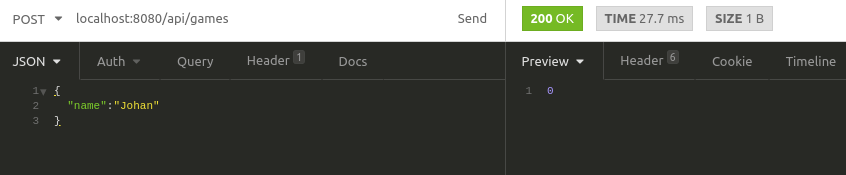
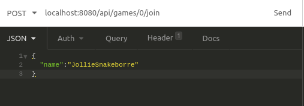
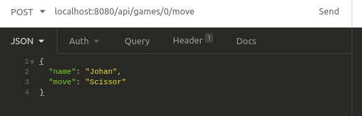
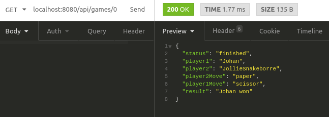

# Rock paper scissor backend api

## Getting started
### Requirements
- node v8.10.0 or higher
- npm 3.5.2 or higher
### Installation
npm install
### Run development server
npm run dev
### Build for production
npm build
### Run for production
npm run start
### Run tests
npm test
### Lint
npm run lint

## How to play
I have been using insomnia (https://insomnia.rest/) to play, but other http clients will work just as fine.

1. Start the server (by running "npm build && npm run start" for example). Make sure you have the IP of the server if playing remotely. In the examples localhost have been used.
2. Player 1 creates a new game by sending "POST /api/games" with {name: [player1Name]} as body to the ip of server with port 8080 by default. An id is returned. 
;
3. Player 1 sends the id to player 2.
4. Player 2 sends "POST /api/games/:id/join" with {name: [player2Name]} as body using the id received from player 1, to join the game.
;
The game is now ongoing, meaning the players can make their moves.
5. Both players send their moves with "POST /api/games/:id/move" with {name: [playerName], move: ["rock"/"paper"/"scissor"]} as body, using the game id. 
;
6. The game result is obtained by sending "GET /api/games/:id". The players can now see who won.
;